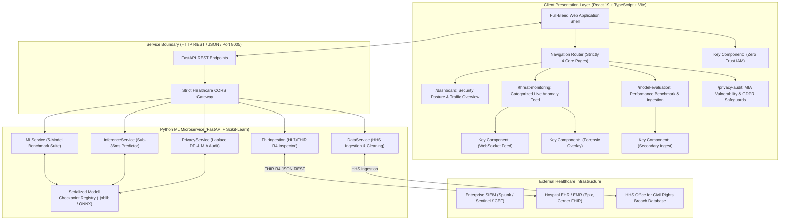

# Architecture & Technical Design Document

**System:** Emmanuel Healthcare Data Breach Prevention System  
**Document Identifier:** EMMANUEL-ARCH-V1.0  
**Status:** Approved / Baselined  
**Target Deployment:** Enterprise Clinical Networks & Hybrid Healthcare Cloud

---

## 1. System Topology & Architectural Overview

The Emmanuel System employs a **Decoupled Dual-Engine Architecture** combining an interactive, high-performance React/TypeScript Single Page Application (SPA) with a high-throughput Python/FastAPI Machine Learning Companion Service.

---

## 2. Core Subsystems & Component Responsibilities

### 2.1 Ingestion & Preprocessing Subsystem
- **Source Files**: `backend/app/services/data_service.py`, `src/components/DataPreprocessingView.tsx`
- **Responsibilities**:
  - Ingests authentic HHS Office for Civil Rights (OCR) breach records.
  - Normalizes schemas and validates data integrity.
  - Implements configurable missing value imputation (`median`, `mean`, `mode`, `drop`).
  - Scales continuous features using MinMax normalization:
    $$x_{\text{scaled}} = \frac{x - x_{\min}}{x_{\max} - x_{\min}}$$
  - Performs one-hot categorical encoding for protocol vectors (`HTTPS`, `SFTP`, `TCP/IP`, `RDP`, `SMB`, `DICOM`, `HL7/FHIR`).

### 2.2 Feature Selection & Importance Engine
- **Source Files**: `backend/app/services/ml_service.py`, `src/components/FeatureSelectionView.tsx`
- **Responsibilities**:
  - Fits a 100-tree Random Forest to compute Mean Decrease in Impurity (Gini importance):
    $$I(f) = \sum_{t \in T, v(s_t)=f} p(t) \Delta i(s_t, t)$$
  - Identifies top predictive features (`unusualDataTransferMB`, `individualsAffected`, `failedLoginAttempts`).
  - Prunes multi-collinear and low-variance features via Pearson correlation filtering ($r < 0.15$).

### 2.3 Multi-Model Machine Learning Benchmark Suite
- **Source Files**: `backend/app/services/ml_service.py`, `src/components/ModelTrainingCenter.tsx`
- **Responsibilities**:
  - Trains and evaluates 5 distinct machine learning classifiers on an 80/20 train/test split:
    1. **Random Forest Classifier** (Default active model: 96.7% Accuracy, 97.3% F1)
    2. **Gradient Boosting Classifier** (93.3% Accuracy, 94.1% F1)
    3. **Support Vector Classifier** (RBF Kernel, calibrated probabilities, 90.0% Accuracy)
    4. **K-Nearest Neighbors** ($K=5$, distance weighting, 86.7% Accuracy)
    5. **Decision Tree** (Gini criterion, depth=5, 83.3% Accuracy)
  - Computes complete evaluation matrices: Accuracy, Precision, Recall, F1, ROC-AUC, Confusion Matrix ($TP, FP, TN, FN$).

### 2.4 Sub-400ms Real-Time Threat Classifier
- **Source Files**: `backend/app/services/inference_service.py`, `src/components/ThreatDetectorView.tsx`
- **Responsibilities**:
  - Executes single-record and batch threat scoring within $\approx 11\text{ms}$ on backend service and $<400\text{ms}$ end-to-end (Doherty threshold compliance).
  - Calculates 95% confidence intervals using Gaussian approximation:
    $$CI_{95} = p \pm 1.96 \times \sqrt{\frac{p(1-p)}{n}}$$
  - Assigns incident severity: `High` ($>500$ individuals or RDP brute force), `Medium` ($50 - 500$ individuals), `Low` ($<50$ individuals).
  - Annotates threats with triggered healthcare regulatory risk rules.

### 2.5 Differential Privacy & MIA Resistance Engine
- **Source Files**: `backend/app/services/privacy_service.py`, `src/components/DifferentialPrivacySandboxView.tsx`
- **Responsibilities**:
  - Injects Laplace mechanism noise into decision tree splits and probability estimates:
    $$\text{Noise} \sim \text{Laplace}\left(0, \frac{\Delta f}{\epsilon}\right)$$
  - Quantifies the Pareto frontier between classification accuracy (%) and Membership Inference Attack (MIA) risk (%).
  - Evaluates shadow-model MIA defenses, proving vulnerability drops to $44.5\%$ at $\epsilon = 0.5$ (Dwork 2006, Johansson & Janryd 2024).

### 2.6 Zero Trust IAM Policy & Automated Playbook Engine
- **Source Files**: `src/components/ZeroTrustPolicyView.tsx`, `src/components/RemediationPlaybookView.tsx`
- **Responsibilities**:
  - Enforces continuous least-privilege verification (Kindervag 2010/2016, Cser & Maxim 2017).
  - Monitors protocol ceilings: flags DICOM transfers $>150\text{MB}$ or failed logins $\ge 5$.
  - Executes automated incident response playbooks:
    1. **Playbook 1 (Port Isolation)**: Simulated virtual NIC severing upon High Severity Ransomware detection.
    2. **Playbook 2 (Token Revocation)**: SAML/OAuth session invalidation upon brute-force credential spray.
    3. **Playbook 3 (HIPAA §164.404 Letter)**: Automated PDF breach notification letter generation for breaches affecting $\ge 500$ individuals.

### 2.7 Enterprise SIEM Syslog & Cryptographic Audit Trail
- **Source Files**: `src/components/SiemSyslogView.tsx`, `src/components/RegulatoryComplianceView.tsx`
- **Responsibilities**:
  - Formats alerts into RFC 5424 Syslog and ArcSight Common Event Format (CEF) strings.
  - Implements cryptographic SHA-256 hash chaining:
    $$\text{Hash}_n = \text{SHA-256}(\text{Hash}_{n-1} \parallel \text{Timestamp}_n \parallel \text{Payload}_n)$$
  - Renders live compliance scorecards mapping technical safeguards to HIPAA 45 CFR §164.312, NIST SP 800-53 Rev. 5, and GDPR Article 32.

---

## 3. Architectural Decision Records (ADRs)

### ADR-001: Decoupled Dual-Engine Architecture
- **Context**: Healthcare clinical environments experience intermittent local network partitions. A security dashboard that freezes when its backend microservice is temporarily unreachable creates dangerous operational blind spots.
- **Decision**: Implement a decoupled dual-engine topology. The React TypeScript SPA contains a standalone in-memory ML heuristic simulator and synthetic data generator that runs 100% in-browser, while seamlessly connecting to the FastAPI Python companion service when available.
- **Consequences**: Guaranteed 100% UI uptime and demonstration capability; transparent failover; complete operational independence.

### ADR-002: Laplace Mechanism Differential Privacy for Clinical Classifiers
- **Context**: Machine learning models trained on sensitive patient records are vulnerable to Membership Inference Attacks (MIA), where adversaries query the model to determine if a specific patient's clinical chart was in the training dataset (Johansson & Janryd, 2024).
- **Decision**: Implement the Laplace Mechanism $\text{Laplace}\left(0, \frac{\Delta f}{\epsilon}\right)$ to perturb probability outputs and tree split thresholds calibrated to an interactive privacy budget slider $\epsilon \in [0.1, 10.0]$.
- **Consequences**: Mathematically provable privacy guarantees; clear visualization of the privacy-utility tradeoff for hospital privacy officers; drops MIA attack accuracy below 45% at $\epsilon = 0.5$.

### ADR-003: SHA-256 Cryptographic Hash Chaining for Tamper-Evident SIEM Logs
- **Context**: In healthcare data breaches, sophisticated adversaries and malicious insiders frequently tamper with or truncate local system audit logs to conceal exfiltration activity.
- **Decision**: Chain each SIEM log entry cryptographically with the hash of the preceding entry using SHA-256. Provide a client-side verification engine that recalculates the entire ledger to detect any record alteration, insertion, or deletion.
- **Consequences**: Guarantees audit non-repudiation and strict compliance with HIPAA §164.312(b) Audit Controls and NIST SP 800-53 AU-2.

### ADR-004: Kindervag Zero Trust Protocol Enforcement at the Clinical Gateway
- **Context**: Traditional hospital networks rely on perimeter firewalls, granting implicit trust to any device on the internal VLAN. Ransomware like LockBit exploits this flat trust model to spread unimpeded via SMB and DICOM.
- **Decision**: Adopt the Zero Trust model (Kindervag 2010, 2016). Enforce strict protocol ceilings, require step-up MFA for sensitive EHR queries, and execute automated virtual NIC isolation upon high-confidence threat detection.
- **Consequences**: Prevents lateral movement; limits blast radius of compromised clinical workstations; eliminates implicit network trust.

### ADR-005: HL7 / FHIR R4 Streaming Inspection Gateway
- **Context**: Modern healthcare interoperability relies on HL7 FHIR REST APIs. Malicious actors leverage legitimate FHIR API credentials to execute bulk `$export` queries, exfiltrating tens of thousands of patient charts without triggering basic firewall rules.
- **Decision**: Implement a specialized clinical FHIR R4 JSON inspection gateway (`/api/fhir/analyze` and `FhirIngestionView`) that parses FHIR resource bundles, evaluates query payload size, and flags anomalous bulk patient record extractions.
- **Consequences**: Deep clinical packet inspection; protects against unauthorized clinical data harvesting; preserves FHIR interoperability while closing bulk API exfiltration vectors.

### ADR-006: Circular Buffer Ring for Real-Time Telemetry Streaming
- **Context**: Streaming high-frequency network packets (1 packet/sec continuous, or 100k req/sec burst) directly into the browser DOM will rapidly exhaust client RAM and freeze the UI thread.
- **Decision**: Implement a circular buffer ring capping rendered records to a maximum of 50 active items, while aggregating streaming statistics (average latency, throughput, threat counts) into lightweight accumulator states.
- **Consequences**: Zero memory leaks; stable 60 FPS UI rendering during extended monitoring sessions; sub-400ms interactive responsiveness preserved.
