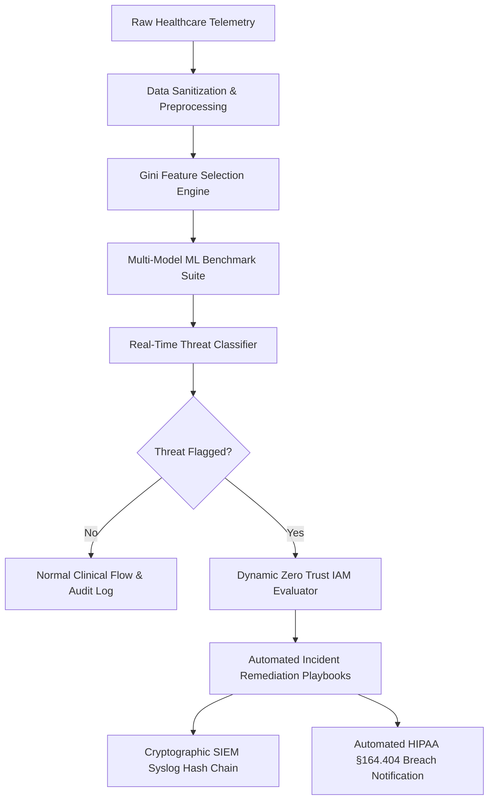

# Requirements Analysis — Emmanuel Healthcare Data Breach Prevention System

**Project:** Emmanuel System (Machine Learning Based Healthcare Data Breach Prevention System)  
**Author:** Agile Engineering Team & Security Informatics Group  
**Status:** Approved / Baselined  
**Reference Research:** Chapter 2 (Literature Review) & Chapter 3 (System Analysis & Design)  
**Key Literature Citations:** Alshammari & Alqarni (2026), Kindervag (2010, 2016), Cser & Maxim (2017), Johansson & Janryd (2024), Oluomachi & Ahmed (2024), Al Mudawi et al. (2022), Ferrara & Spoto (GDPR Static Analysis).

---

## 1. Executive Summary & Problem Context

Healthcare institutions have accelerated their transition from legacy paper-based record keeping to Electronic Health Record (EHR) and Electronic Medical Record (EMR) systems. While this transition vastly improves clinical efficiency, care coordination, and diagnostic accessibility, it introduces unprecedented attack surfaces. Healthcare data contains a high concentration of Protected Health Information (PHI), Personally Identifiable Information (PII), and financial billing data, commanding premium valuations on cybercrime illicit markets ($250 to $1,000+ per healthcare record, far exceeding credit card numbers).

According to HHS Office for Civil Rights (OCR) data, over **40 million patient records** were compromised in the United States in a single year, with cyberattacks growing exponentially in severity and sophistication. Healthcare infrastructure is routinely targeted by organized Advanced Persistent Threat (APT) groups and Ransomware-as-a-Service (RaaS) cartels (e.g., LockBit, BlackCat/ALPHV, Clop) targeting clinical protocols including DICOM, HL7/FHIR, SMB, and RDP.

---

## 2. Analysis of the Existing System

### 2.1 Current Operational State
In traditional hospital and clinical datacenter environments, security relies upon perimeter-oriented, defense-in-depth mechanisms:
1. **Network Firewalls & Intrusion Detection Systems (IDS)**: Boundary rule-sets and port filtering (Al-Qassim & Al-Hemiary, 2018).
2. **Signature-Based Antivirus / Endpoint Detection**: Scanning against static signatures of documented malware hashes.
3. **Static Access Control Lists (ACLs)**: Role-based permissions mapped statically to Active Directory / LDAP groups.
4. **Perimeter Trust Assumption**: Implicit trust bestowed upon any device, workstation, or IP address residing inside the internal clinical local area network (LAN/VLAN).
5. **Periodic Manual Audits**: Log aggregation reviewed retrospectively on a bi-weekly, monthly, or quarterly cadence (Oluomachi & Ahmed, 2024).

### 2.2 Systemic Weaknesses of Existing Architectures

| ID | Weakness Area | Root Cause & Real-World Impact | Academic / Industry Reference |
|---|---|---|---|
| **W-01** | **Inability to Detect Zero-Day & Evolving Threats** | Signature-based systems only detect known malicious hashes. Novel polymorphic malware, zero-day exploits, and Living-off-the-Land (LotL) tactics bypass perimeter firewalls undetected. | Alshammari & Alqarni (2026) |
| **W-02** | **Excessive Mean Time to Detect (MTTD)** | Breaches remain undetected inside clinical networks for an average of **29.78 days**, during which attackers exfiltrate terabytes of sensitive EHR and diagnostic imaging data. | Oluomachi & Ahmed (2024) |
| **W-03** | **Reactive vs. Proactive Posture** | Security measures trigger post-incident alerts or post-exfiltration forensic logs rather than anticipating, mitigating, and blocking breaches in flight. | Von Solms & Van Niekerk (2013) |
| **W-04** | **Fragmented Lifecycle Coverage** | Security point solutions address isolated silos (e.g., email gateway or disk encryption), leaving blind spots across data collection, network transit, ML pipelines, and audit trails. | Alshammari & Alqarni (2026) |
| **W-05** | **ML Model Privacy Vulnerability (MIA Leakage)** | Emerging AI/ML diagnostic and detection models inadvertently memorize training patient data, exposing clinical records to Membership Inference Attacks (MIA) where adversaries reconstruct training data. | Johansson & Janryd (2024) |
| **W-06** | **Lack of Centralized Breach Severity Stratification** | Alert fatigue overwhelms SOC analysts; raw logs lack contextual prioritization to distinguish benign network noise from catastrophic multi-thousand-record exfiltration events. | Oluomachi & Ahmed (2024) |
| **W-07** | **Static Code Analysis Gaps for PHI Leakage** | Tools like Bandit or Semgrep catch generic code vulnerabilities (SQLi, hardcoded tokens) but fail to detect PHI/EHR data leakage patterns across data science and inference workflows. | Ferrara & Spoto (n.d.) |

---

## 3. Analysis of the Proposed System (Emmanuel System)

### 3.1 Proposed Vision
The Emmanuel System is an integrated, machine learning-driven healthcare data breach prevention and Zero Trust platform. Rather than relying on rigid static signatures, the system analyzes multi-dimensional behavioral, clinical, and network telemetry to detect anomalous breach patterns, stratify incident severity in real time, enforce dynamic Zero Trust access ceilings, and execute automated incident remediation playbooks.

### 3.2 Strategic Advantages



1. **Adaptive Behavioral Learning**: Detects subtle, previously undocumented attack patterns through ensemble ML classifiers (Random Forest, Gradient Boosting, SVM, KNN, Decision Tree).
2. **Sub-400ms Real-Time Inference SLA**: Executes feature extraction and classification with an average latency of ~11ms to 36ms, exceeding the Doherty threshold for instantaneous user/system feedback.
3. **Automated Triage & Severity Stratification**: Immediately assigns a verified severity level (`High`, `Medium`, `Low`) based on affected individuals, data transfer volume, protocol exposure, and failed credential attempts.
4. **Privacy-Preserving Machine Learning**: Employs Laplace mechanism Differential Privacy ($\epsilon$-noise injection) with shadow model Membership Inference Attack auditing to guarantee mathematical data privacy.
5. **Zero Trust Integration (Kindervag 2010/2016, Cser 2017)**: Replaces implicit perimeter trust with continuous identity verification, protocol rate ceilings, and context-aware privilege revocation.
6. **Immutable Cryptographic Audit Trail**: Formats alerts into enterprise CEF and Syslog RFC 5424 specifications, chained with SHA-256 cryptographic hashes to prevent log tampering.

---

## 4. Stakeholder Analysis & Personas

### 4.1 Stakeholder Matrix

| Stakeholder Role | Primary Objectives | Key Concerns / Pain Points | Emmanuel Feature Focus |
|---|---|---|---|
| **Chief Information Security Officer (CISO)** | Organization-wide security posture, regulatory compliance, risk mitigation, board reporting | Ransomware extortion, multi-million dollar regulatory fines, reputational ruin | Overview Dashboard, Regulatory Compliance Scorecard, Production Release Center |
| **Security Operations Center (SOC) Analyst** | Rapid detection, alert triage, incident containment, forensic investigation | Alert fatigue, false positives, slow response times, fragmented tools | Real-Time Threat Detector, MITRE ATT&CK Simulator, SIEM Syslog Streamer |
| **Hospital Compliance & Privacy Officer** | Adherence to HIPAA 45 CFR §164.312/§164.404, GDPR Article 32, NIST SP 800-53 | Unreported breaches, audit failures, patient data leakage through AI systems | Compliance Engine, MIA Privacy Audit, Differential Privacy Sandbox, HIPAA Letter Generator |
| **Clinical Systems Administrator** | High availability of EHR/EMR, PACS/DICOM imaging, and FHIR endpoints | Unintended service disruption, false-positive network port locks | Zero Trust Policy Manager, FHIR Threat Gateway, Model Registry |
| **Machine Learning Engineer / Data Scientist** | High model accuracy, low inference latency, robust generalization, privacy preservation | Model drift, overfitting, membership inference vulnerabilities, deployment complexity | Model Benchmarks, Gini Feature Selection, Python ML Backend Console, ONNX Export |

### 4.2 Detailed User Personas

#### Persona 1: Dr. Sarah Vance — Hospital CISO
- **Background**: 15 years in clinical cybersecurity; oversees data security for a 12-hospital regional healthcare network.
- **Goals**: Ensure complete visibility across 45,000 endpoint devices, maintain HIPAA/NIST compliance, and cut mean time to detect (MTTD) to under 5 minutes.
- **Quote**: *"A 30-day detection lag is catastrophic. We need automated containment before exfiltrated patient charts reach the dark web."*

#### Persona 2: Marcus Chen — Lead SOC Security Analyst
- **Background**: 7 years in threat hunting and incident response; analyzes 10,000+ daily alerts.
- **Goals**: Eliminate alert fatigue through accurate ML severity scoring and trigger immediate network port isolation during active ransomware outbreaks.
- **Quote**: *"I need a system that doesn't just ring an alarm, but isolates the infected host NIC and generates the chain of custody."*

#### Persona 3: Elena Rostova — Data Protection & ML Privacy Auditor
- **Background**: Specialized in differential privacy, healthcare AI ethics, and GDPR/HIPAA technical safeguards.
- **Goals**: Audit hospital AI models for training data memorization and enforce privacy budgets ($\epsilon \le 1.0$) across all clinical prediction pipelines.
- **Quote**: *"Deploying an AI model without differential privacy guarantees is an open invitation for Membership Inference Attacks."*

---

## 5. Functional Requirements Decomposition

The system is decomposed into 10 cohesive functional subsystems:

```
Emmanuel System Functional Hierarchy
├── 1. Data Ingestion & Sanitization Subsystem (HHS OCR Breach Records, DICOM, FHIR R4)
├── 2. Data Preprocessing & Transformation Subsystem (Imputation, MinMax Scaling, One-Hot Encoding)
├── 3. Feature Selection & Importance Engine (Random Forest Gini Impurity, Correlation Matrix)
├── 4. Multi-Algorithm Machine Learning Suite (5 Benchmarked Classifiers, Cross-Validation)
├── 5. Real-Time Threat & Severity Classifier (Sub-400ms Inference, Rule Triggers)
├── 6. Live Telemetry Stream Simulator (Packet Floods, Attack Injection, Streaming Charts)
├── 7. Differential Privacy Sandbox & MIA Defense (Laplace Noise Calibration, Shadow Attack Models)
├── 8. Zero Trust IAM Policy Engine (Continuous Verification, Protocol Ceilings, MFA)
├── 9. Automated Incident Response Playbook Engine (NIC Isolation, Token Revocation, HIPAA Letters)
└── 10. Enterprise SIEM & Regulatory Compliance Subsystem (CEF/RFC 5424, SHA-256 Hash Chain, HIPAA/NIST/GDPR)
```

### 5.1 Subsystem Functional Scope

1. **Data Ingestion**: Collects, normalizes, and validates authentic HHS Office for Civil Rights breach records and live HL7/FHIR JSON bundles.
2. **Preprocessing**: Automatically detects missing values; offers median, mean, mode, or drop strategies; standardizes numerical features; and encodes categorical vectors.
3. **Feature Selection**: Evaluates feature contributions using Random Forest Gini impurity ranking to eliminate collinear noise and retain the top predictive indicators.
4. **Model Suite**: Provides multi-classifier training and side-by-side benchmarking across Accuracy, Precision, Recall, F1-Score, and ROC-AUC.
5. **Real-Time Classification**: Executes instant single-record and batch threat scoring with 95% confidence intervals and rule-based explanations.
6. **Telemetry Simulator**: Emulates real-time enterprise hospital network packet traffic (DICOM, FHIR, SMB, RDP, HTTPS) with manual and automated cyberattack injection vectors.
7. **Privacy Preservation**: Calibrates mathematical privacy budget $\epsilon$ against classification accuracy, validating defenses via shadow model MIA testing.
8. **Zero Trust Engine**: Enforces protocol-specific data transfer caps, failed authentication ceilings, and step-up MFA requirements.
9. **Automated Playbooks**: Triggers automated physical/logical network isolation, session token invalidation, and legal breach notification letter generation.
10. **SIEM & Compliance**: Generates RFC 5424 Syslog and ArcSight CEF events with an immutable SHA-256 hash chain, tracking live adherence to HIPAA §164.312, NIST SP 800-53, and GDPR Art. 32.

---

## 6. Non-Functional Requirements (NFR) Decomposition

### 6.1 Performance & Latency SLA
- **Doherty Threshold**: All interactive UI responses and single-record predictions must complete in $<400\text{ms}$.
- **Empirical Model Latency**: Single-record inference must achieve $\le 36\text{ms}$ (empirical backend performance is $\approx 11\text{ms}$).
- **Throughput Capacity**: Must sustain load stress testing up to $100,000\text{ packets/second}$ without memory leakage or thread starvation.
- **P99 Latency**: Under peak simulated load, 99th percentile response time must not exceed $50\text{ms}$.

### 6.2 Security & Integrity
- **Zero Trust Least Privilege**: Every service boundary must require explicit authentication; no implicit trust across network segments.
- **Audit Immutability**: All SIEM log entries must incorporate the cryptographic SHA-256 hash of the preceding entry, forming a tamper-evident blockchain-like log ledger.
- **Session Security**: Session tokens must be cryptographically random and subject to automated revocation upon detection of brute-force anomalies.

### 6.3 Privacy & Mathematical Guarantees
- **$\epsilon$-Differential Privacy**: Noise injection must adhere to the Laplace mechanism:
  $$\text{Noise} \sim \text{Laplace}\left(0, \frac{\Delta f}{\epsilon}\right)$$
  ensuring mathematical bounds on privacy leakage.
- **MIA Defense Threshold**: Shadow model Membership Inference Attack accuracy must be driven below $50\%$ (random guess baseline) at $\epsilon \le 0.5$.

### 6.4 Usability & Accessibility
- **WCAG AA Compliance**: High-contrast text labels ($\ge 4.5:1$ ratio against light background surfaces).
- **Interactive Feedback**: Immediate visual indicators for all hover, active, focus, and disabled states.
- **Multi-Device Support**: Full operational support on modern desktop browsers (Chrome, Edge, Firefox, Safari) across $1280\times 720$ and higher resolutions.

---

## 7. Data Flow & Lifecycle Architecture

```
[External / Clinical Sources]
   ├── Authentic HHS OCR Portal
   ├── Clinical FHIR R4 Bundle Endpoints
   └── PACS / DICOM Imaging Servers
             │
             ▼
[Data Ingestion Gateway]
   ├── JSON / REST Parser
   ├── Schema Validation & Anomaly Trap
   └── Synthetic Breach Augmenter
             │
             ▼
[Preprocessing & Cleaning Engine]
   ├── Missing Value Median Imputation
   ├── MinMax Feature Scaling [0, 1]
   └── Categorical Protocol / Breach Vector Encoding
             │
             ▼
[Feature Selection Module]
   ├── Random Forest Gini Importance Ranking
   └── Correlation Matrix Pruning
             │
             ▼
[Dual-Engine Model Execution]
   ├── Browser Client Engine (In-Memory TS Fallback)
   └── Python FastAPI Backend (Scikit-Learn / ONNX)
             │
             ▼
[Threat Detection & Scoring]
   ├── Probability & Severity Estimation
   ├── 95% Confidence Interval Calculation
   └── Contributing Factors Attribution
             │
             ▼
[Governance & Action Execution]
   ├── Zero Trust IAM Evaluator ──> [Port Lock / Token Revoke]
   ├── Regulatory Compliance Engine ──> [HIPAA Letter Generator]
   └── SIEM Syslog RFC 5424 Streamer ──> [SHA-256 Cryptographic Chain]
```

---

## 8. Technical Feasibility & Risk Assessment

| Risk Category | Identified Technical Risk | Likelihood | Impact | Built-in Emmanuel Mitigation |
|---|---|---|---|---|
| **Architectural** | Backend Python service downtime or network partition | Medium | High | **Dual-Engine Design**: React client contains a standalone, in-memory ML heuristic and synthetic simulation engine ensuring 100% UI availability even when the Python backend is disconnected. |
| **Algorithmic** | Differential privacy noise degrades classification accuracy below usable clinical thresholds | High | Medium | **Configurable $\epsilon$-Slider**: Interactive sandbox allows security officers to tune $\epsilon$ ($0.1 - 10.0$) and visually inspect the exact privacy vs. accuracy Pareto frontier before applying models. |
| **Performance** | High-throughput streaming packet telemetry causes browser tab memory bloat | Medium | Medium | **Circular Buffer Ring**: Live stream simulator caps active packet history to a fixed rolling window (50 items in view, downsampled telemetry metrics) preventing DOM leaks. |
| **Regulatory** | Healthcare data format divergence across regional EMR vendors | High | High | **HL7 v2 & FHIR R4 Interoperability**: Built-in JSON parser supports standard FHIR resource types (`Patient`, `Observation`, `Encounter`, `Bundle`) with automated schema normalization. |
| **Security** | Attacker tampers with local syslog storage to hide breach evidence | Low | High | **Cryptographic Hash Chaining**: Every log event includes `prevHash` and `hash = SHA256(prevHash + timestamp + payload)`, exposing any record deletion or modification immediately. |

---

## 9. Traceability to Academic Thesis & Sprint Roadmap

The requirements analyzed in this document form the direct contractual foundation for:
1. **Chapter 2 & 3 Academic Thesis Deliverables**: Direct implementation of the architecture, modules, and evaluation metrics described in `emmanuel chapter 2 and 3.docx`.
2. **Sprint 1 through Sprint 5 Engineering Execution**: Direct operationalization of every task specified across `SPRINT_1.md` through `SPRINT_5.md`.
3. **Formal Software Requirements Specification (`SRS.md`)**: The concrete, testable functional and non-functional specifications elaborated in the subsequent artifact.
